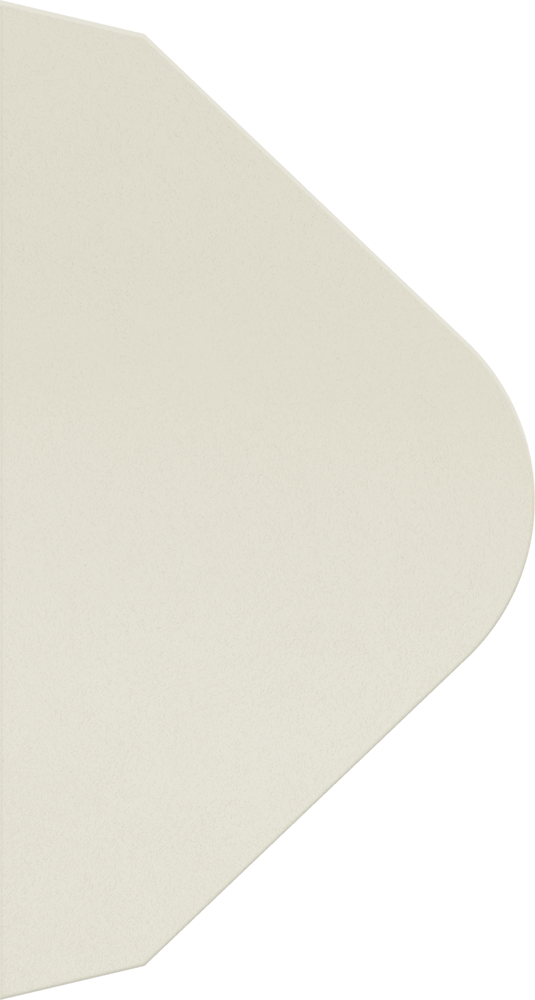

# Envelope Overlay — How To (Reusable Add-On)

Envelope overlay adalah animasi pembuka amplop yang muncul sebelum konten utama halaman. Add-on ini dirancang agar bisa dipasang di website **static HTML** manapun dengan **3 langkah saja** (copy file → link CSS → script JS). HTML overlay **di-inject otomatis** — tidak perlu menambah blok HTML manual.

---

## Daftar Isi

1. [Arsitektur](#arsitektur)
2. [File yang Dibutuhkan](#file-yang-dibutuhkan)
3. [Struktur HTML Target](#struktur-html-target)
4. [Instalasi Langkah demi Langkah](#instalasi-langkah-demi-langkah)
5. [Cara Kerja Animasi](#cara-kerja-animasi)
6. [Konfigurasi Selector](#konfigurasi-selector)
7. [Kustomisasi Teks dan Waktu](#kustomisasi-teks-dan-waktu)
8. [Menonaktifkan Overlay](#menonaktifkan-overlay)
9. [Troubleshooting](#troubleshooting)

---

## Arsitektur

```
┌─────────────────────────────────────┐
│         Envelope Overlay            │
│  ┌─────┐ ┌──────┐ ┌────────────┐   │
│  │ Top │ │ Left │ │   Right    │   │
│  │Flap │ │ Flap │ │   Flap     │   │
│  └─────┘ └──────┘ └────────────┘   │
│        ┌────────────┐               │
│        │   Bottom   │               │
│        └────────────┘               │
│     "You're invited to" (teks)      │
└─────────────────────────────────────┘
                │
                ▼  (animasi selesai, overlay hilang)
┌─────────────────────────────────────┐
│         Konten Utama                │
│  Nav │ Hero │ Section lainnya      │
└─────────────────────────────────────┘
```

Addon terdiri dari 3 lapisan:

- **HTML** — struktur overlay + gambar amplop
- **CSS** — semua style, transisi, dan animasi
- **JS** — logika urutan animasi (sequence timing)

---

## File yang Dibutuhkan

| File | Fungsi | Wajib? |
|------|--------|--------|
| `envelope.js` | Logika animasi + template HTML (self-injecting) | Ya |
| `envelope.css` | Style overlay dan animasi | Ya |
| `assets/images/envelope-*.png` | Gambar 4 layer amplop | Ya |
| `envelope.html` | Referensi struktur HTML (opsional, untuk kustomisasi manual) | Tidak |

> **Self-injecting:** `envelope.js` otomatis menyuntikkan HTML overlay ke `<body>`
> saat halaman load. Anda tidak perlu menambah blok HTML manual.
> File `envelope.html` hanya referensi jika ingin mengkustomisasi struktur.

Gambar amplop yang dibutuhkan:

- `envelope-top.png` — flap atas (segitiga, buka dengan rotasi 3D)
- `envelope-left.png` — sisi kiri
- `envelope-right.png` — sisi kanan
- `envelope-bottom.png` — sisi bawah

---

## Struktur HTML Target

Website target **tidak perlu menambahkan blok HTML envelope** — overlay otomatis
di-inject oleh `envelope.js`. Yang **harus ada** di website target hanya elemen
hero dan navigasi:

```html
<!-- Wajib: Section hero atau section utama yang mau dianimasikan -->
<section class="hero" id="hero">
    <div class="hero-image">
        
    </div>
    <div class="hero-content">
        <!-- Teks yang mau dianimasikan letter-by-letter -->
        <h2 id="heroSubtitle">The wedding of</h2>
        <h1 id="heroTitle">Sarah &amp; Samuel</h1>
    </div>
</section>

<!-- Wajib: Navigasi -->
<nav class="main-nav" id="mainNav">
    <a href="#">Logo</a>
    <a href="#section1">Link 1</a>
</nav>
```

**Catatan penting:**
- HTML envelope **di-inject otomatis** oleh `envelope.js` — tidak perlu menambahkannya manual.
- Teks hero **harus dipecah per huruf** dalam `<span class="letter">` agar animasi letter-by-letter berjalan. Lihat [Kustomisasi Teks](#kustomisasi-teks-dan-warna) untuk cara otomatis.

---

## Instalasi Langkah demi Langkah

### Langkah 1 — Copy file

```
your-website/
├── index.html          ← website kamu (hanya tambah 2 baris link/script)
├── css/
│   └── styles.css      ← style website kamu
│   └── envelope.css    ← style envelope (baru)
├── js/
│   └── script.js       ← script website kamu
│   └── envelope.js     ← script envelope (baru, self-injecting)
└── assets/
    └── images/
        ├── envelope-top.png
        ├── envelope-left.png
        ├── envelope-right.png
        └── envelope-bottom.png
```

### Langkah 2 — Tambahkan CSS

Di `<head>` website target, tambahkan link ke `envelope.css` **sebelum** style utama:

```html
<head>
    <!-- Envelope Addon CSS -->
    <link rel="stylesheet" href="css/envelope.css">

    <!-- Style utama website -->
    <link rel="stylesheet" href="css/styles.css">
</head>
```

### Langkah 3 — Tambahkan JS

Di akhir `<body>`, tambahkan script `envelope.js` **sebelum** script utama:

```html
    <!-- Envelope Addon JS (self-injecting) -->
    <script src="js/envelope.js"></script>

    <!-- Script utama website -->
    <script src="js/script.js"></script>
</body>
```

**HTML overlay otomatis disuntikkan** oleh `envelope.js` — tidak perlu menambah
blok HTML manual. Jika ingin menonaktifkan overlay, lihat
[Menonaktifkan Overlay](#menonaktifkan-overlay).

### Langkah 4 — Pastikan CSS hero mendukung animasi

Tambahkan CSS berikut ke style utama website target:

```css
/* Hero image default: offset (akan di-reveal oleh addon) */
.hero-image {
    position: absolute;
    inset: 0;
    transform: scale(0.9) translateY(140px);
    transition: transform 1.2s cubic-bezier(0.25, 0.46, 0.45, 0.94);
}
.hero.revealed .hero-image {
    transform: scale(1) translateY(0);
}

/* Hero text: default hidden, akan dianimasikan */
.hero-subtitle .letter,
.hero-title .letter,
.hero-title .amp {
    display: inline-block;
    opacity: 0;
    transform: translateY(20px);
    filter: blur(4px);
    transition: opacity 0.6s cubic-bezier(0.44, 0, 0.56, 1),
                transform 0.6s cubic-bezier(0.44, 0, 0.56, 1),
                filter 0.6s cubic-bezier(0.44, 0, 0.56, 1);
}
.hero.animate .hero-subtitle .letter,
.hero.animate .hero-title .letter,
.hero.animate .hero-title .amp {
    opacity: 1;
    transform: translateY(0);
    filter: blur(0px);
}

/* Nav default: hidden, akan muncul */
.main-nav {
    opacity: 0;
    transform: translateY(-150px);
    transition: opacity 0.8s cubic-bezier(0.44, 0, 0.56, 1),
                transform 0.8s cubic-bezier(0.44, 0, 0.56, 1);
}
.main-nav.visible {
    opacity: 1;
    transform: translateY(0);
}
```

---

## Cara Kerja Animasi

### Dengan overlay (default)

| Waktu | Aksi |
|-------|------|
| 0.2s  | Teks "You're invited to" muncul huruf per huruf |
| 3.0s  | Flap atas terbuka (rotasi 3D `rotateX(-180deg)`) |
| 3.3s  | Sisi kiri, kanan, bawah slide ke bawah (`translateY(110vh)`) |
| 4.1s  | Hero image zoom in (scale 0.9 → 1) |
| 5.1s  | Overlay hilang, nav muncul, hero text animasi letter-by-letter |
| 6.1s  | Overlay dihapus dari DOM |

### Tanpa overlay (fallback)

| Waktu | Aksi |
|-------|------|
| 0s    | Hero image zoom in |
| 0.4s  | Navigasi muncul |
| 0.8s  | Hero text animasi letter-by-letter |

Add-on mendeteksi secara otomatis: jika `#envelopeOverlay` tidak ada di DOM, jalankan fallback.

---

## Konfigurasi Selector

Jika class/ID di website target berbeda dari default, ada 3 cara menyesuaikan:

### Opsi A — Ganti class/ID di HTML target

Ubah elemen target di website agar sesuai dengan selector bawaan addon:

| Selector | Yang dicari |
|----------|-------------|
| `#envelopeOverlay` | Overlay itu sendiri |
| `#inviteText .letter` | Teks "You're invited to" |
| `#heroSubtitle .letter` | Teks judul hero |
| `#heroTitle .letter` | Teks nama/pengantin |
| `#heroTitle .amp` | Tanda `&` |
| `.hero` | Section hero |
| `.hero.revealed` | State hero setelah reveal |
| `.hero.animate` | State hero saat animasi text |
| `#mainNav` | Navigasi |
| `.main-nav.visible` | State nav setelah muncul |

### Opsi B — Ubah selector di JS

Buka `envelope.js` dan ganti selector sesuai website target:

```js
// Default
const hero = document.querySelector('.hero');
const mainNav = document.getElementById('mainNav');

// Ganti ke class website target
const hero = document.querySelector('.my-hero-section');
const mainNav = document.querySelector('.my-navbar');
```

### Opsi C — Tambahkan class/ID tambahan

Di HTML target, tambahkan class/ID yang diharapkan addon tanpa menghapus class asli:

```html
<!-- Website target pakai class "landing-hero" -->
<section class="landing-hero hero" id="hero">
    <!-- hero tetap bisa di-target oleh addon -->
</section>
```

---

## Kustomisasi Teks dan Waktu

### Mengganti teks "You're invited to"

Edit bagian `#inviteText` di dalam HTML overlay:

```html
<h4 class="invite-heading" id="inviteText">
    <span class="word">
        <span class="letter">B</span><span class="letter">u</span><span class="letter">k</span><span class="letter">a</span>
    </span>
    <span class="word">
        <span class="letter">u</span><span class="letter">n</span><span class="letter">d</span><span class="letter">a</span><span class="letter">n</span><span class="letter">.</span>
    </span>
</h4>
```

**Penting:** Setiap huruf harus dalam `<span class="letter">` sendiri-sendiri.

### Mengganti teks hero

Pecah teks hero per huruf:

```html
<h1 id="heroTitle">
    <span class="word">
        <span class="letter">R</span><span class="letter">i</span><span class="letter">z</span><span class="letter">k</span><span class="letter">i</span>
    </span>
    <span class="amp">&amp;</span>
    <span class="word">
        <span class="letter">A</span><span class="letter">n</span><span class="letter">i</span>
    </span>
</h1>
```

### Mengubah timing animasi

Edit nilai timeout di `envelope.js`:

```js
function runEnvelopeAnimation() {
    // ...
    // Ganti 3000 → 2000 agar flap buka lebih cepat
    setTimeout(() => {
        envelopeOverlay.classList.add('open');
    }, 2000);  // sebelumnya 3000
    // ...
}
```

**Referensi timing default:**

| Timeout | Nilai | Fungsi |
|---------|-------|--------|
| Letter delay | 0.04s | Delay antar huruf "You're invited to" |
| Open flap | 3000ms | Waktu sebelum flap terbuka |
| Hero revealed | 4100ms | Hero image mulai zoom in |
| Hero animate | 5100ms | Nav muncul + hero text animasi |
| Remove overlay | 6100ms | Overlay dihapus dari DOM |

### Mengubah easing/transisi

CSS envelope menggunakan easing `cubic-bezier(0.16, 1, 0.3, 1)` (spring-like). Ganti di `envelope.css`:

```css
/* Default */
transition: transform 1.2s cubic-bezier(0.16, 1, 0.3, 1);

/* Lebih cepat */
transition: transform 0.8s cubic-bezier(0.16, 1, 0.3, 1);

/* Lebih lambat */
transition: transform 2s cubic-bezier(0.16, 1, 0.3, 1);
```

### Mengubah warna

Ubah CSS variables di `envelope.css`:

```css
:root {
    --bg-color: #efeee4;       /* warna background overlay */
    --text-color: #262626;     /* warna teks di amplop */
    --white: #ffffff;
    --font-serif: 'Playfair Display', serif;  /* font teks amplop */
}
```

---

## Menonaktifkan Overlay

### Cara 1 — Flag di HTML (Recommended)

Tambahkan atribut `data-envelope="disabled"` di tag `<body>`:

```html
<body data-envelope="disabled">
```

`envelope.js` akan melewatkan injeksi HTML overlay dan langsung menjalankan
animasi hero tanpa envelope. Tidak perlu mengubah file JS atau CSS.

### Cara 2 — Hapus file JS

Hapus atau comment out baris script di HTML target:

```html
<!-- <script src="js/envelope.js"></script> -->
```

### Cara 3 — Hapus dari DOM via JS

Jika overlay sudah terlanjur di-inject dan ingin dihapus sebelum animasi:

```js
// Di script utama, sebelum DOMContentLoaded addon
document.getElementById('envelopeOverlay')?.remove();
```
    runFallbackAnimation();
    return;
}
```

---

## Troubleshooting

### Amplop tidak muncul

- Pastikan gambar `envelope-*.png` ada di path yang benar
- Pastikan `envelope.css` ter-load (cek Network tab di DevTools)
- Pastikan `#envelopeOverlay` ada di DOM (cek Elements tab)

### Teks hero tidak muncul setelah amplop terbuka

- Pastikan elemen hero memiliki class `.hero`
- Pastikan `#heroSubtitle` dan `#heroTitle` ada di dalam hero
- Pastikan teks hero dipecah per huruf dalam `<span class="letter">`

### Navigasi tidak muncul

- Pastikan nav memiliki ID `mainNav`
- Pastikan CSS transition `.main-nav.visible` ada di style utama

### Amplop muncul dua kali

- Pastikan hanya ada satu `#envelopeOverlay` di DOM
- Cek apakah ada script lain yang mengkloning elemen

### Animasi terasa lambat/cepat

- Ubah nilai timeout di `envelope.js`
- Ubah durasi transition di `envelope.css`

---

## Contoh Integrasi Lengkap

```html
<!DOCTYPE html>
<html lang="id">
<head>
    <meta charset="UTF-8">
    <meta name="viewport" content="width=device-width, initial-scale=1.0">
    <title>Website Saya</title>
    <link rel="stylesheet" href="css/envelope.css">
    <link rel="stylesheet" href="css/styles.css">
</head>
<body>
    <!-- ENVELOPE ADDON START -->
    <div class="envelope-overlay" id="envelopeOverlay">
        <div class="envelope-scene">
            <div class="env-variant">
                <div class="env-layer env-right">
                    
                </div>
                <div class="env-layer env-left">
                    
                </div>
                <div class="env-layer env-bottom">
                    
                </div>
                <div class="env-layer env-top">
                    
                    <div class="env-invite-text">
                        <h4 class="invite-heading" id="inviteText">
                            <span class="word">
                                <span class="letter">Y</span><span class="letter">o</span><span class="letter">u</span><span class="letter">'</span><span class="letter">r</span><span class="letter">e</span>
                            </span>
                            <span class="word">
                                <span class="letter">i</span><span class="letter">n</span><span class="letter">v</span><span class="letter">i</span><span class="letter">t</span><span class="letter">e</span><span class="letter">d</span>
                            </span>
                            <span class="word">
                                <span class="letter">t</span><span class="letter">o</span>
                            </span>
                        </h4>
                    </div>
                </div>
            </div>
        </div>
    </div>
    <!-- ENVELOPE ADDON END -->

    <!-- Website content -->
    <nav class="main-nav" id="mainNav">
        <a href="#">Logo</a>
    </nav>

    <section class="hero" id="hero">
        <div class="hero-image">
            
        </div>
        <div class="hero-content">
            <h2 id="heroSubtitle">
                <span class="word">
                    <span class="letter">W</span><span class="letter">e</span><span class="letter">l</span><span class="letter">c</span><span class="letter">o</span><span class="letter">m</span><span class="letter">e</span>
                </span>
            </h2>
            <h1 id="heroTitle">
                <span class="word">
                    <span class="letter">M</span><span class="letter">y</span>
                </span>
                <span class="amp">&amp;</span>
                <span class="word">
                    <span class="letter">W</span><span class="letter">e</span><span class="letter">b</span><span class="letter">s</span><span class="letter">i</span><span class="letter">t</span><span class="letter">e</span>
                </span>
            </h1>
        </div>
    </section>

    <script src="js/envelope.js"></script>
    <script src="js/script.js"></script>
</body>
</html>
```
